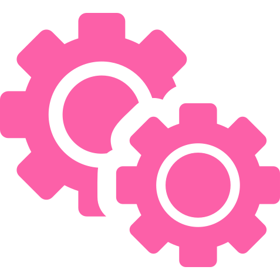

# Back End

  

# Contents
- [Python](./python/README.md)
  - [Building .pdf with custom data from html (Python/Django)](./python/building_pdf_from_html_python.md)  
  - [Building .pdf with custom data from image (Python/Django)](./python/building_pdf_from_image_python.md)  
  - [Split list into columns filling up each row to the maximum equal length possible (Python/Django)](./python/split_list_into_columns.md)  
  - [Django rest framework error handler (Python/Django)](python/djnago_rest_framework_error_handler.md)  
- [JS](./js/README.md)
- [DevOps](./devops/README.md)
  - [Continuous integration](./devops/continuous_integration.md)  
  - [Docker](./docker.md) 
  - [Init Kubernetes cluster on AWS](./devops/init_kubernetes_cluster_aws.md)  
  - [Nginx Installation and Configuration](./devops/nginx.md) 
