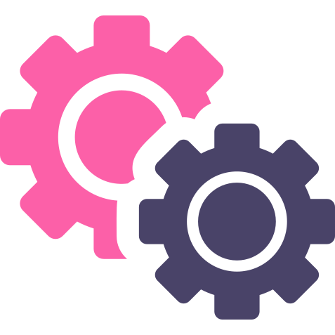

# Back End

An awesome and curated list of best tools and practices that we use at [DB2 Limited](https://db2.io).

  

# Contents
- [Python](./backend/python/README.md)
  - [Building .pdf with custom data from html (Python/Django)](backend/python/building_pdf_from_html_python.md)  
  - [Building .pdf with custom data from image (Python/Django)](backend/python/building_pdf_from_image_python.md)  
  - [Split list into columns filling up each row to the maximum equal length possible (Python/Django)](backend/python/split_list_into_columns.md)  
  - [Django rest error pattern middleware (Python/Django)](backend/python/djnago_rest_framework_error_middleware.md)  
- [JS](./backend/js/README.MD)
- [DevOps](./backend/devops/README.ms)
  - [Continuous integration](backend/devops/continuous_integration.md)  
  - [Docker](./backend/docker.md) 
  - [Init Kubernetes cluster on AWS](backend/devops/init_kubernetes_cluster_aws.md)  
  - [Nginx Installation and Configuration](backend/devops/nginx.md) 
