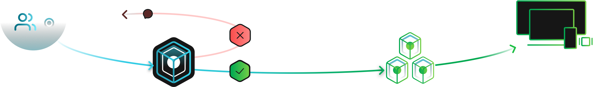
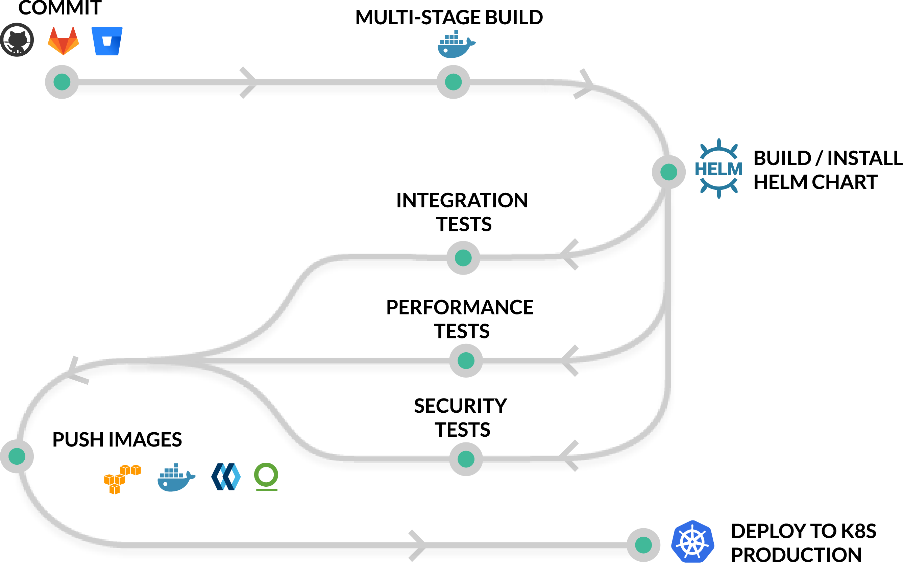
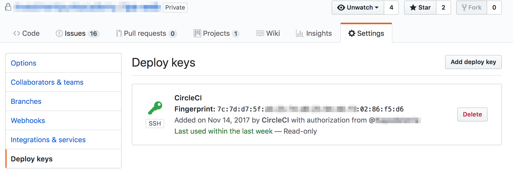
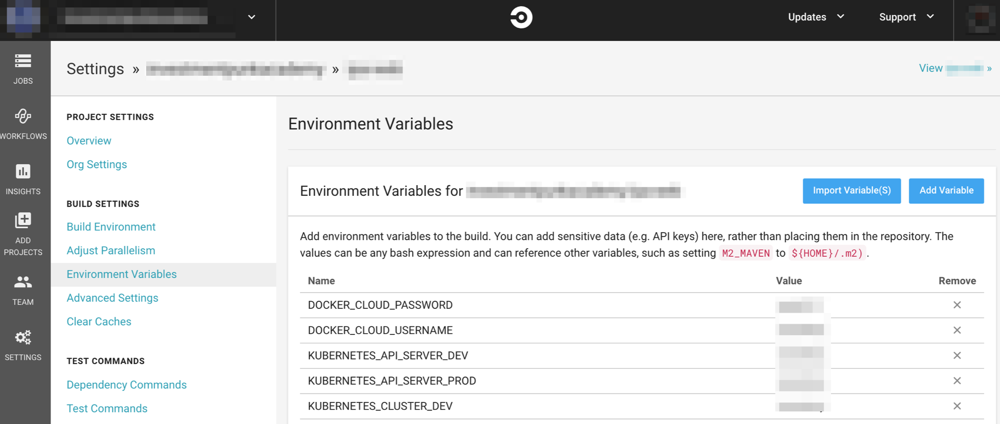

# Continuous integration

**Continuous integration** - practice in software engineering of merging all project copies on which the developers are working with the mainline several times a day. The main aim of CI is to prevent integration problems for different parts of a project . This is done by verifying each code push by an automated build, allowing developers to detect problems quickly and easily.

The most widely used CI services allow for integration with third party code hosts, such as GitHub or BitBucket. Those that are integrated with these code hosts, run the automated tasks after each push to the project repository.

Good CI services nowadays should be fast, as in create and run builds as fast as possible by parallelizing processes, they should have multiple language and platform support, SSH support and they should be easy to setup.

## Continuous integration services
- [AWS CodePipeline](https://aws.amazon.com/codepipeline/)
- [BitBucket Pipelines](https://bitbucket.org/product/features/pipelines)
- [Circle CI](https://circleci.com/)
- [Codefresh](https://codefresh.io/)
- [Drone](https://drone.io/)
- [Gitlab CI](https://about.gitlab.com/features/gitlab-ci-cd/)
- [Travis CI](https://travis-ci.org/)


## Examples of workflow
### CircleCI workflow
<p align="center">
  
</p>

### Codefresh workflow
<p align="center">
  
</p>

### TravisCI workflow
<p align="center">
  
</p>

## Configuration files
Most of the continuous integration services already have the default configuratong files for each programming language & framework, but if you need to run some custom commands (running tests, install some dependencies, use different parent docker image etc) you can create a sample configuration file. The next overview will explain how you can work with [CircleCI 2.0](https://circleci.com), other CI services are very similar.

You need to sign up on [CircleCI](https://circleci.com) so they will generate an `Deploy key` in your [VCS](https://en.wikipedia.org/wiki/Version_control), so they can access your code base and be notified when you push some changes.

<p align="center">
  
</p>

In the root folder of your project create folder `.circleci` and `config.yml` file inside this folder.
This is your [YAML](https://en.wikipedia.org/wiki/YAML) based CircleCI config.

### Basic example config.yml
```
version: 2
jobs:
  build:
    docker:
      - image: <username>/<image>:<tag>
    steps:
      - checkout
```
This `config.yml` will tell CircleCI to:
- pull docker image from the  registry (you can also get the ready to go images from [CircleCI Docker Hub](https://hub.docker.com/r/circleci/))
- pull your codebase from VCS

### Running custom command
If you want to run some custom command (e.g. build/test) just add more steps to the `build` job with `name` and `command` fields:
```
version: 2
jobs:
  build:
    docker:
      - image: circleci/node:latest
    steps:
      - checkout
      - run:
          name: Install dependencies
          command: npm i
```
### Caching
It's not so good to install the same dependencies each build in the continuous integration service. CircleCI provides you an interface to cache what you need. For that purpose you need to use the `restore_cache` and `save_cache` to build the checksum of some file (`requirements.txt` or `package.json` for example)
```
version: 2
jobs:
  build:
    docker:
      - image: circleci/node:latest
    steps:
      - checkout
      - restore_cache:
          key: dependency-cache-{{ .Branch }}-{{ checksum "package.json" }}
      - run:
          name: Install dependencies
          command: npm i
      - save_cache:
          key: dependency-cache-{{ .Branch }}-{{ checksum "package.json" }}
          paths:
            - 'node_modules'
```

### Webhook notifications
When the build is status is changed from queued/running to any other(stoped/success/failed уес) you will receive [POST request with payload](https://circleci.com/docs/1.0/configuration/#notify).
```
version: 2
notify:
  webhooks:
    - url: https://example.com/api/circle-ci/status
jobs:
  build:
    docker:
      - image: circleci/node:latest
    steps:
      - checkout
      - run:
          name: Install dependencies
          command: npm i
```

### Running docker client commands
If you want to run run custom `docker` commands just use the [setup_remote_docker](https://circleci.com/docs/2.0/configuration-reference/#setup_remote_docker) command.
```
version: 2
jobs:
  build:
    docker:
      - image: circleci/node:latest
    steps:
      - checkout
      - setup_remote_docker
      - run:
          name: Install dependencies
          command: npm i
      - run:
          name: Deploy to Docker Cloud
          command: |
            docker login -u <username> -p <password>
            docker build -t <username>/<image>:<tag> .
            docker push <username>/<image>:<tag>
```

### Environment variables
If you need to use [environment variables](https://circleci.com/docs/2.0/env-vars/) for you build configuration, you can easily add them `Build > Project > Settings` in the CircleCI application.

<p align="center">
  
</p>

## References
- [CircleCI 2.0 Sample config](https://circleci.com/docs/2.0/sample-config/)
- [CircleCI 2.0 Configuration reference](https://circleci.com/docs/2.0/configuration-reference/)
- [CircleCI 2.0 Forum](https://discuss.circleci.com/)
