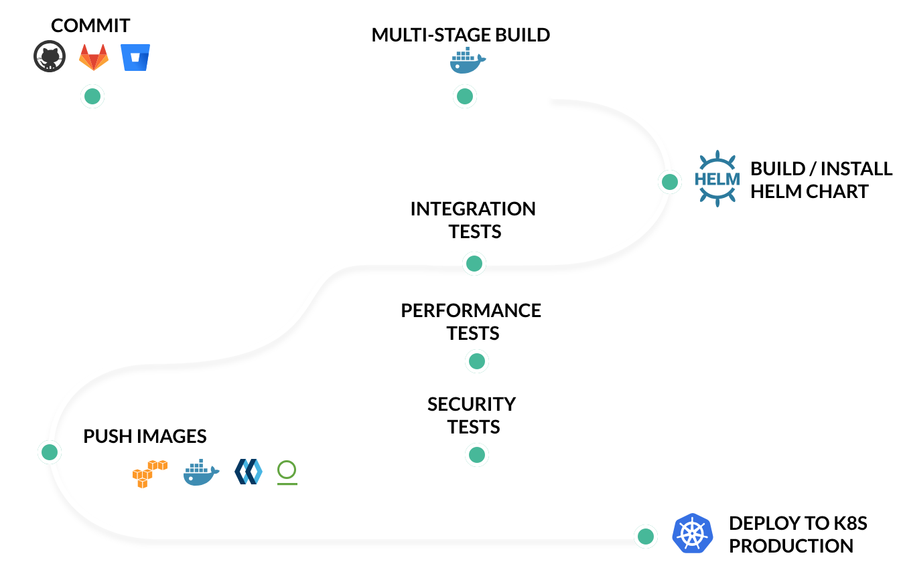

# Continuous integration

**Continuous integration** - practice in software engineering of merging all project copies on which the developers are working with the mainline several times a day. The main aim of CI is to prevent integration problems for different parts of a project . This is done by verifying each code push by an automated build, allowing developers to detect problems quickly and easily.

The most widely used CI services allow for integration with third party code hosts, such as GitHub or BitBucket. Those that are integrated with these code hosts, run the automated tasks after each push to the project repository.

Good CI services nowadays should be fast, as in create and run builds as fast as possible by parallelizing processes, they should have multiple language and platform support, SSH support and they should be easy to setup.

## Continuous integration services
- [AWS CodePipeline](https://aws.amazon.com/codepipeline/)
- [BitBucket Pipelines](https://bitbucket.org/product/features/pipelines)
- [Circle CI](https://circleci.com/)
- [Codefresh](https://codefresh.io/)
- [Drone](https://drone.io/)
- [Gitlab CI](https://about.gitlab.com/features/gitlab-ci-cd/)
- [Travis CI](https://travis-ci.org/)

## Examples of workflow

  
  <i>CircleCI workflow</i>

***

  
  <i>TravisCI workflow</i>

***

  
  <i>Codefresh workflow</i>

