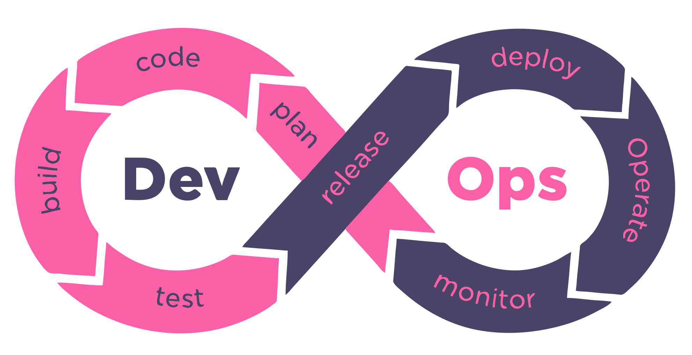

# DevOps
Best experience from awesome people :whale:

  

# Contents
- [DevOps](README.md)
  - [Continuous integration](continuous_integration.md)  
  - [Docker](docker.md) 
  - [Init Kubernetes cluster on AWS](init_kubernetes_cluster_aws.md)  
  - [Nginx Installation and Configuration](nginx.md) 
 