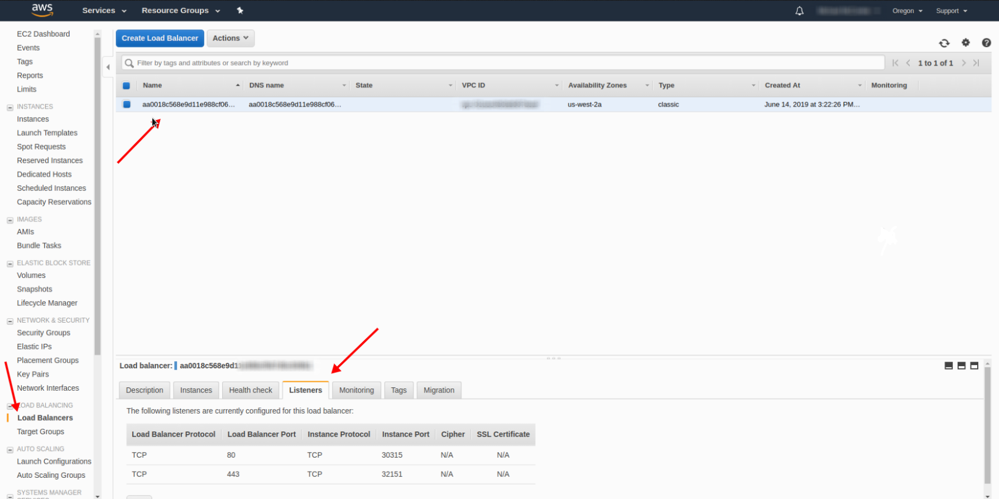
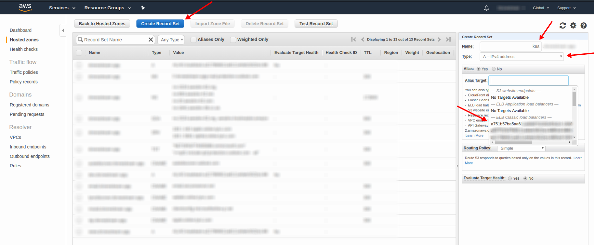

# Deploy ingress to aws cluster
##### Table of Contents

- [Base info](#)
  - [Ingress](#)
- [Setup ingress-nginx](#)
  - [Add and setup ingress-nginx](#)
  - [Simple ingress example](#)
- [Knows errors](#)
 ---

**Ingress** - is an object that allows access to your Kubernetes services from outside the Kubernetes cluster. You configure access by creating a collection of rules that define which inbound connections reach which services.
[Learn more about ingress](https://kubernetes.io/docs/concepts/services-networking/ingress/)
[Learn more about ingress-nginx](https://github.com/kubernetes/ingress-nginx)
[Simple explanation](https://matthewpalmer.net/kubernetes-app-developer/articles/kubernetes-ingress-guide-nginx-example.html)

## Setup ingress-nginx
### Add and setup ingress-nginx
To install ingress-nginx controller to your cluster, just run following commands.
```bash
kubectl apply -f https://raw.githubusercontent.com/kubernetes/ingress-nginx/master/deploy/static/mandatory.yaml
kubectl apply -f https://raw.githubusercontent.com/kubernetes/ingress-nginx/master/deploy/static/provider/aws/service-l4.yaml
kubectl apply -f https://raw.githubusercontent.com/kubernetes/ingress-nginx/master/deploy/static/provider/aws/patch-configmap-l4.yaml 
```
To check if the ingress controller pods have started, run the following command.
Once the operator pods are running, you can cancel the above command by typing `Ctrl+C`
```bash
kubectl get pods --all-namespaces -l app.kubernetes.io/name=ingress-nginx --watch
```

After it, you'll see created load balancer in your aws ec2 dashboard and opened 80 and 443 ports on it.

<p align="left">
  
</p>

Now you can use your load balancer name like an alias.

<p align="left">
  
</p>

### Simple ingress example
```yaml
apiVersion: extensions/v1beta1
kind: Ingress
metadata:
  name: example-ingress
  namespace: default
  annotations:
    kubernetes.io/ingress.class: "nginx"
    kubernetes.io/force-ssl-redirect: "true"
    kubernetes.io/tls-acme: "true"
spec:
  tls:
  - hosts:
    - dev.example.com
    - stage.example.com
    - prod.example.com
    secretName: certs.example.com

  rules:
  - host: dev.example.com
    http:
      paths:
      - path: /
        backend:
          serviceName: example-dev
          servicePort: 80  

  - host: stage.example.com
    http:
      paths:
      - path: /
        backend:
          serviceName: example-stage
          servicePort: 80

  - host: prod.example.com
    http:
      paths:
      - path: /
        backend:
          serviceName: example-prod
          servicePort: 80
```

## [Knows errors](./kubernetes_known_errors.md)
