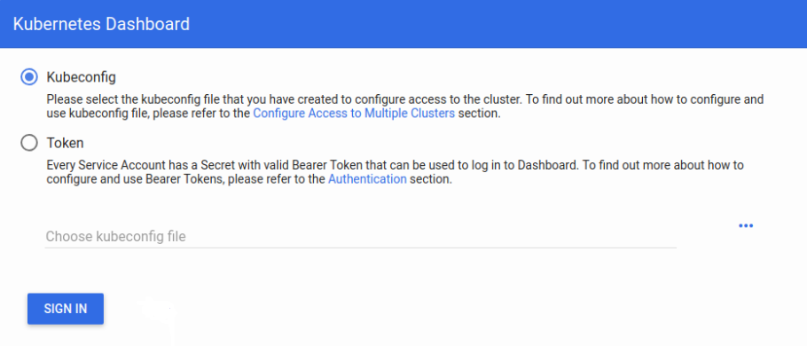
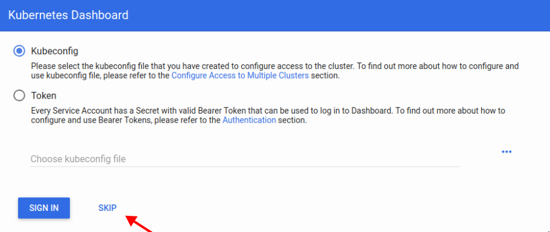
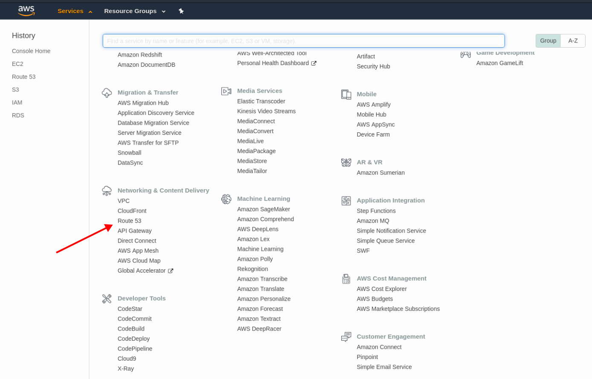
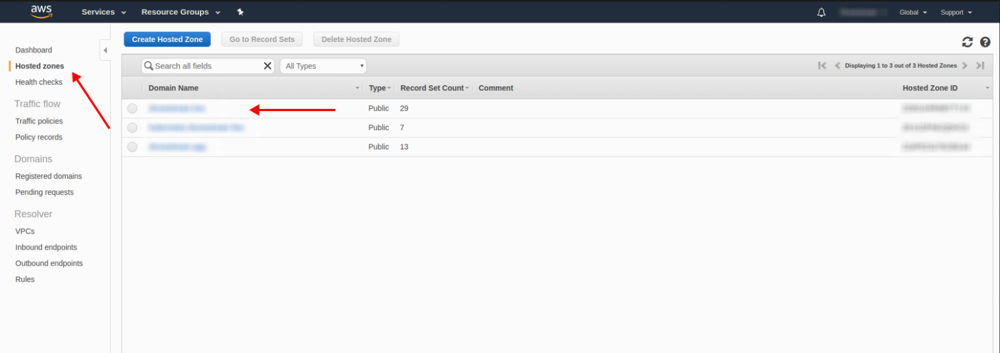
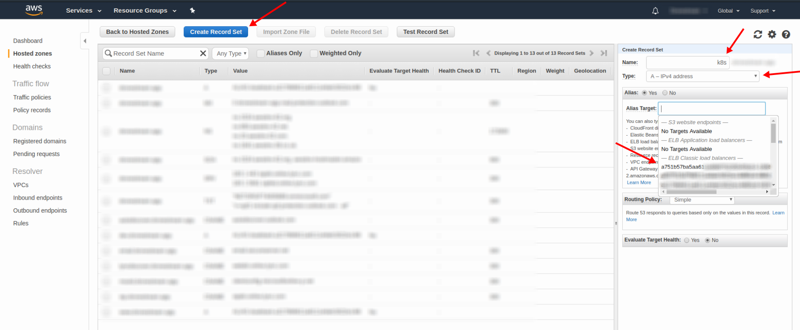

# Deploy kubernetes dashboard to cluster
##### Table of Contents

- [Base info](#base-info)
  - [Kubernetes dashboard](#base-info)
- [Setup dashboard](#setup-dashboard)
  - [Generate certificates](#generate-certificates)
  - [Install dashboard](#install-dashboard)
  - [Add role](#add-role)
  - [Update deployment](#update-deployment)
- [Setup dashboard ingress](#setup-dashboard-ingress)
  - [Create secret](#create-secret)
  - [Basic auth settings](#basic-auth-settings)
  - [Create dashboard ingress](#create-dashboard-ingress)
  - [Add your dashboard route to Route53](#add-your-dashboard-route-to-route53)
- [Uninstall dashboard](#uninstall-dashboard)
- [Knows errors](#knows-errorskubernetes_known_errorsmd)
 ---
 
 ## Base info
 
<p align="left">
  
</p>


**Kubernetes dashboard** - is a general purpose, web-based UI for Kubernetes clusters. It allows users to manage applications running in the cluster and troubleshoot them, as well as manage the cluster itself.
[Learn more](https://github.com/kubernetes/dashboard/tree/master)
 
## Setup dashboard
### Generate certificates
If you want to deploy dashboard with your custom SSL certificates, you need to create secret kubernetes-dashboard-certs before deploy the dashboard. The secret must contain dashboard.crt and dashboard.key data.
```bash
kubectl create secret generic kubernetes-dashboard-certs --from-file=<path_to_folder_with_crt_and_key> -n kube-system
```

### Install dashboard
```bash
kubectl apply -f https://raw.githubusercontent.com/kubernetes/dashboard/v1.10.1/src/deploy/recommended/kubernetes-dashboard.yaml
```

### Add role
Add admin permissions and dashboard log in by token.
```yaml
apiVersion: rbac.authorization.k8s.io/v1beta1
kind: ClusterRoleBinding
metadata:
   name: kubernetes-dashboard
   labels:
     k8s-app: kubernetes-dashboard
roleRef:
   apiGroup: rbac.authorization.k8s.io
   kind: ClusterRole
   name: cluster-admin
subjects:
  - kind: ServiceAccount
    name: kubernetes-dashboard
    namespace: kube-system
```
After this you'll see next modal window after connection to dashboard

<p align="left">
  
</p>

### Update deployment
Now we need add authentication skip button to dashboard log in. For it just add argument `--enable-skip-login` to kubernetes dashboard deployment. Also remove argument `--auto-generate-certificates` if you used custom dashboard certificates.
```bash
kubectl edit deployment/kubernetes-dashboard --namespace=kube-system
```

*example*:
```yaml
containers:
      - args:
        - --auto-generate-certificates   # <-- remove this line, if you used custom certificates
        - --enable-skip-login            # <-- add this line 
        image: k8s.gcr.io/kubernetes-dashboard-amd64:v1.10.1
```

After this you'll see next button on your dashboard modal window.

<p align="left">
  
</p>

## Setup dashboard ingress
### Create secret
If you want to server HTTPS version of Dashboard, which is recommended, you need to create secret with tls.crt and tls.key data.
```yaml
apiVersion: v1
kind: Secret
metadata:
  name: certs-dashboard
  namespace: kube-system
type: Opaque
data:
  tls.crt: <base64_cert_here>
  tls.key: <base64_private_key_here>
```

### Basic auth settings
If you want to secure your dashboard with Nginx basic auth you need to create secret.
```bash
sh -c "echo -n '<username>:' >> auth"
sh -c "openssl passwd -apr1 >> auth"
kubectl create secret generic basic-auth-dashboard --from-file=auth --namespace=kube-system
```

### Create dashboard ingress
When secret created you could create an Ingress object. Only if you already [install ingress](./deploy_ingress_to_aws_cluster.md)
```yaml
apiVersion: extensions/v1beta1
kind: Ingress
metadata:
  name: dashboard-ingress
  namespace: kube-system
  annotations:
    nginx.ingress.kubernetes.io/backend-protocol: "HTTPS"
    nginx.ingress.kubernetes.io/auth-type: basic
    nginx.ingress.kubernetes.io/auth-secret: basic-auth-dashboard
    nginx.ingress.kubernetes.io/auth-realm: "Authentication Required"
spec:
  tls:
    - hosts:
      - <subdomain_for_dashboard>
      secretName: certs-dashboard
  rules:
    - host: <subdomain_for_dashboard>
      http:
        paths:
        - path: /
          backend:
            serviceName: kubernetes-dashboard
            servicePort: 443
```
### Add your dashboard route to Route53
Select Route 53 in your aws account service.

<p align="left">
  
</p>

Select `Hosted zones` in your left menu and choose `<your_domain_name>` hosted zone. 

<p align="left">
  
</p>

For connecting to your dashboard you need add `A` record with name `k8s.<your_domain_name>` to Route 53 and connect to your load balancer alias.

<p align="left">
  
</p>

## Uninstall dashboard
For delete kubernetes dashboard from your cluster use next commands.
```bash
kubectl delete deployment kubernetes-dashboard --namespace=kube-system 
kubectl delete service kubernetes-dashboard  --namespace=kube-system 
kubectl delete role kubernetes-dashboard-minimal --namespace=kube-system 
kubectl delete rolebinding kubernetes-dashboard-minimal --namespace=kube-system
kubectl delete sa kubernetes-dashboard --namespace=kube-system 
kubectl delete secret kubernetes-dashboard-certs --namespace=kube-system
kubectl delete secret kubernetes-dashboard-key-holder --namespace=kube-system
kubectl delete clusterrolebinding kubernetes-dashboard --namespace=kube-system
```

## [Knows errors](./kubernetes_known_errors.md)
