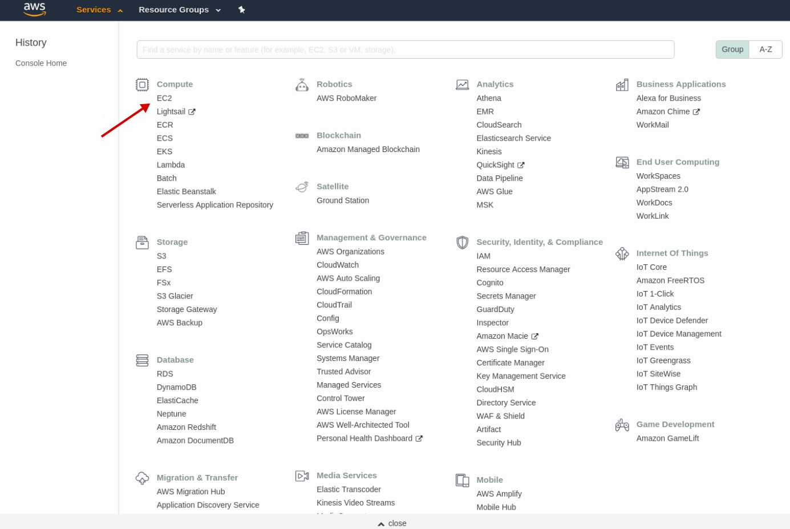
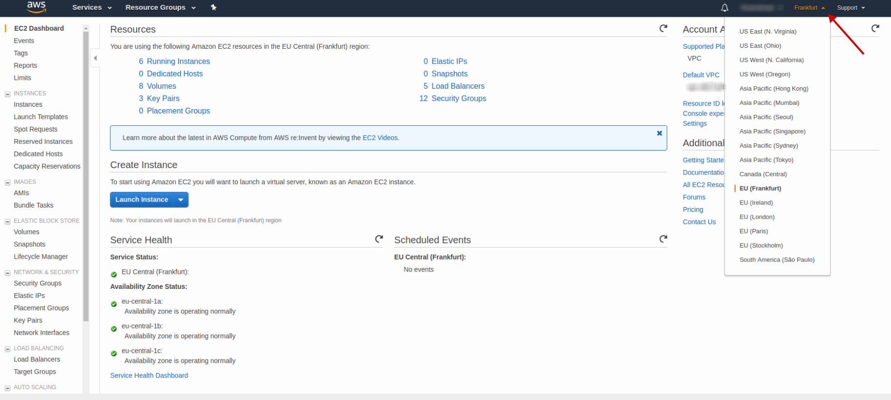
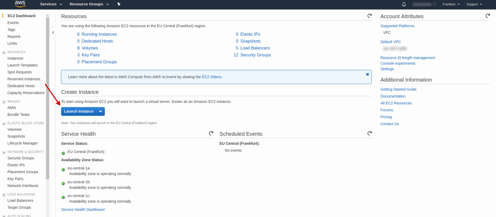
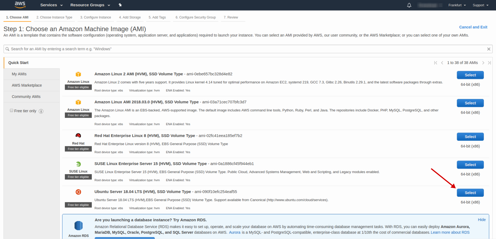
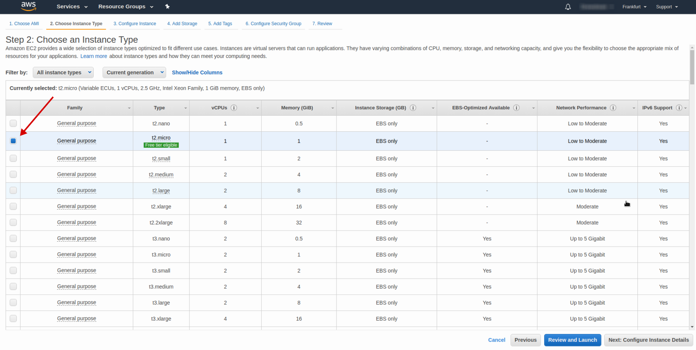
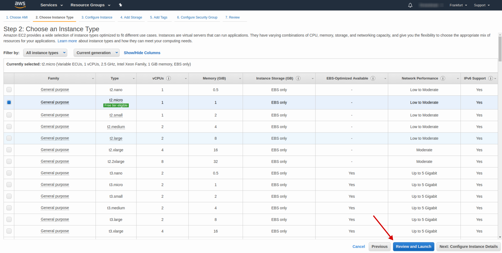
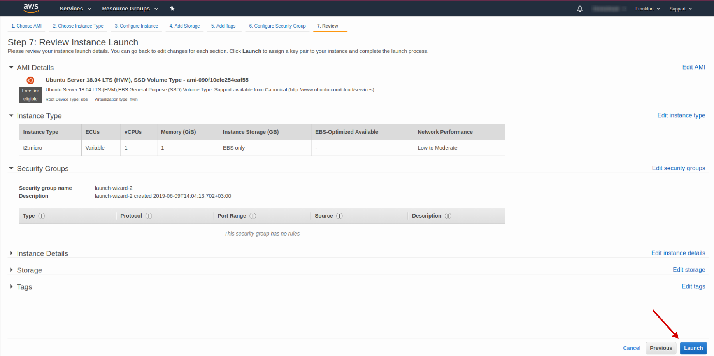
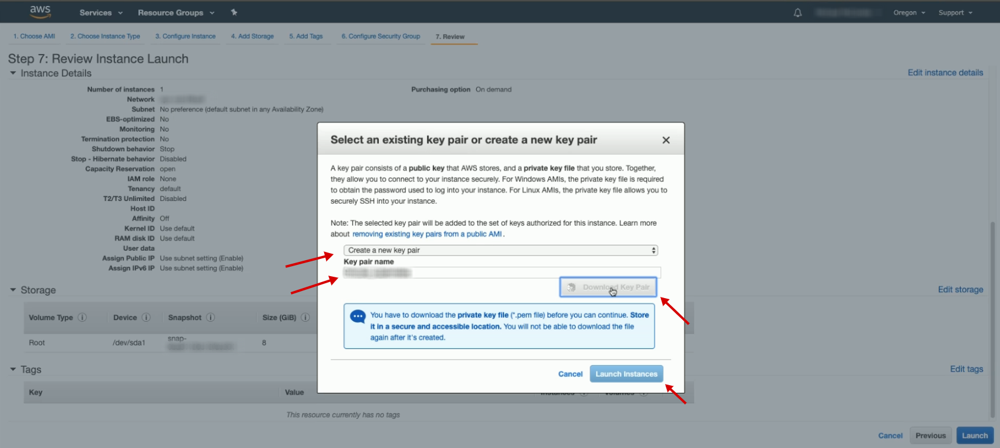
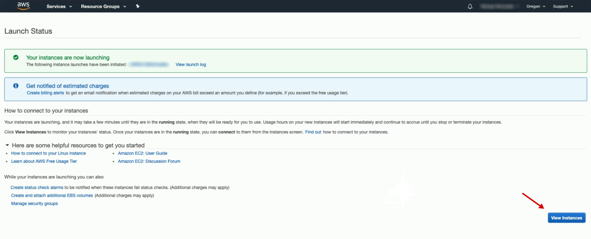
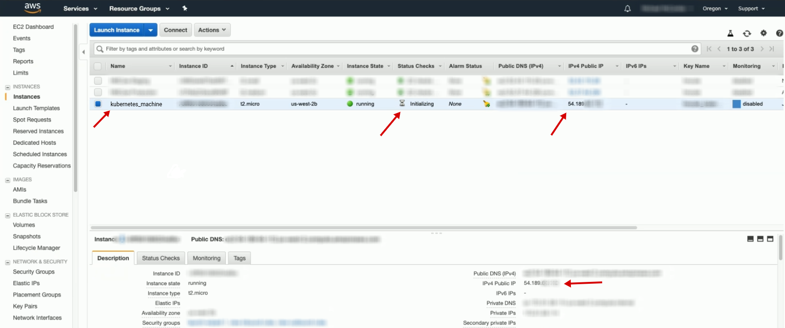

# Create cluster management instance

#### Open [EC2 AWS console](https://eu-central-1.console.aws.amazon.com/ec2/v2/home?region=eu-central-1#Home:)

<p align="center">
  
</p>

#### Select area for you future instance

<p align="center">
  
</p>

#### Press *Launch Instance* button

<p align="center">
  
</p>

#### Choose AMI (use Ubuntu LTS Server)

<p align="center">
  
</p>

#### Choose instance type (use t2.micro, for more detail read [Extra](#extra))

<p align="center">
  
</p>

#### Press *Review and Launch*

<p align="center">
  
</p>

#### Press *Launch*

<p align="center">
  
</p>

#### Choose *Create a new key pair*
#### Add key pair name (e.g *<project_name_or_whatever_unique>_kubernetes*)
#### Press *Download key pair*
#### Press *Launch Instances*

<p align="center">
  
</p>

#### Press *View Instances*

<p align="center">
  
</p>

#### Add you instance name (e.g. *kubernetes_machine*)
#### Copy and save instance IPv4 Public IP

<p align="center">
  
</p>

#### Go to folder with you key pair and run next commands to connect to your instance
```sh
chmod 400 <key_pair_name>.pem
ssh -i <key_pair_name>.pem ubuntu@<instance_ip_v4_address>
yes
sudo apt-get update
sudo apt-get upgrade
```

#### Extra
##### [Instance type info](https://aws.amazon.com/ec2/instance-types/)
##### [Instance price info](https://aws.amazon.com/ec2/pricing/on-demand/)