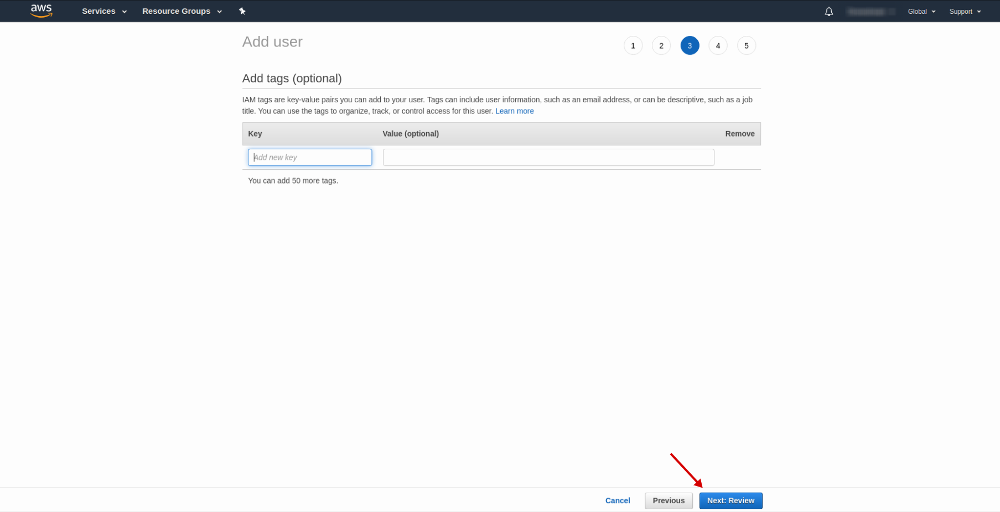
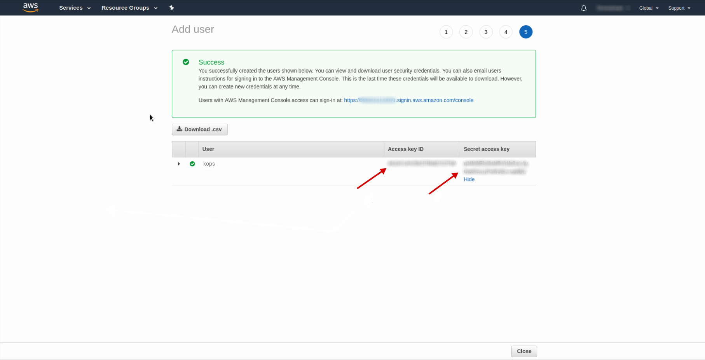
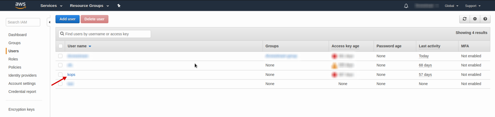

### IAM
#####Open [IAM AWS Console](https://console.aws.amazon.com/iam/home?region=eu-central-1#/users)

  

Press the `Add user` button

  

Enter username `kops`, choose the `Access type` - `Programmatic access` and press `Next:Premissions` button

  

Press `Next:Tags` button

  

Press `Next:Review` button

  

Press `Create user` button

  

Copy the `Access key ID` and `Secret access key` and press `Close` button

  

Choose the `kops` user

  

Press `Add permissions` button

  

Choose `Attach existing policies directly`, only the `Administrator access` and press `Next:Review` button

  

Press `Add permissions` button

  

