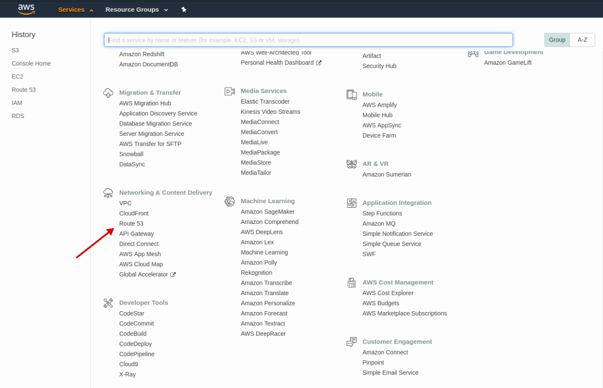
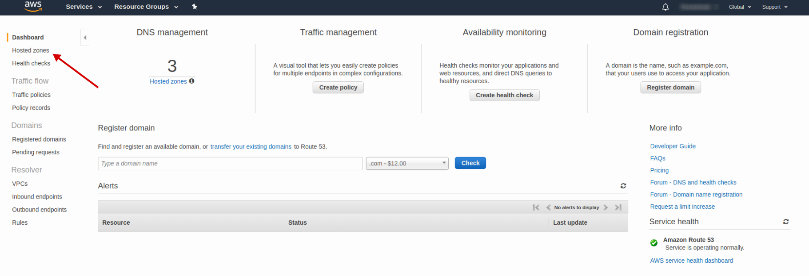
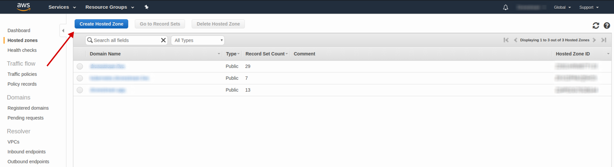
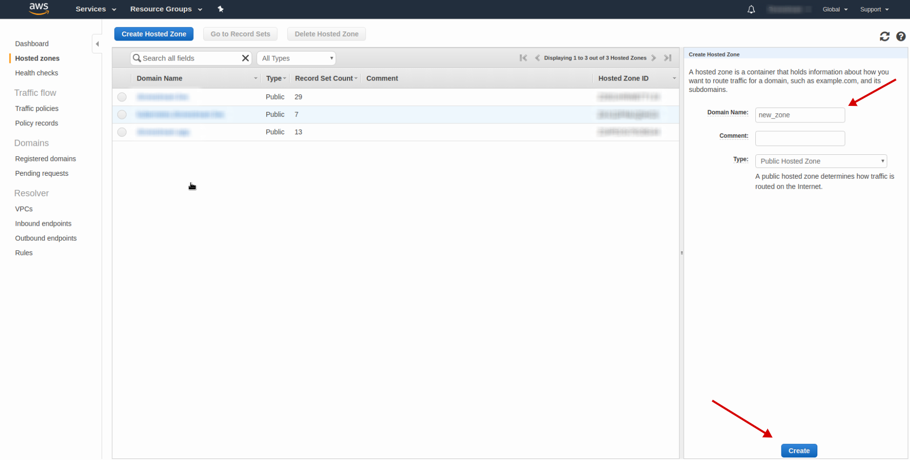

# Route53

- Open [Route53 AWS Console](https://console.aws.amazon.com/route53/home?region=eu-central-1#hosted-zones)
    

      
    

- Choose `Hosted Zones`
    

      
    

- Press `Create Hosted Zone`
    

      
    

- Enter the domain name `<your_domain_name>` (e.g. `example.com`) and press `Create` button
    

      
    
