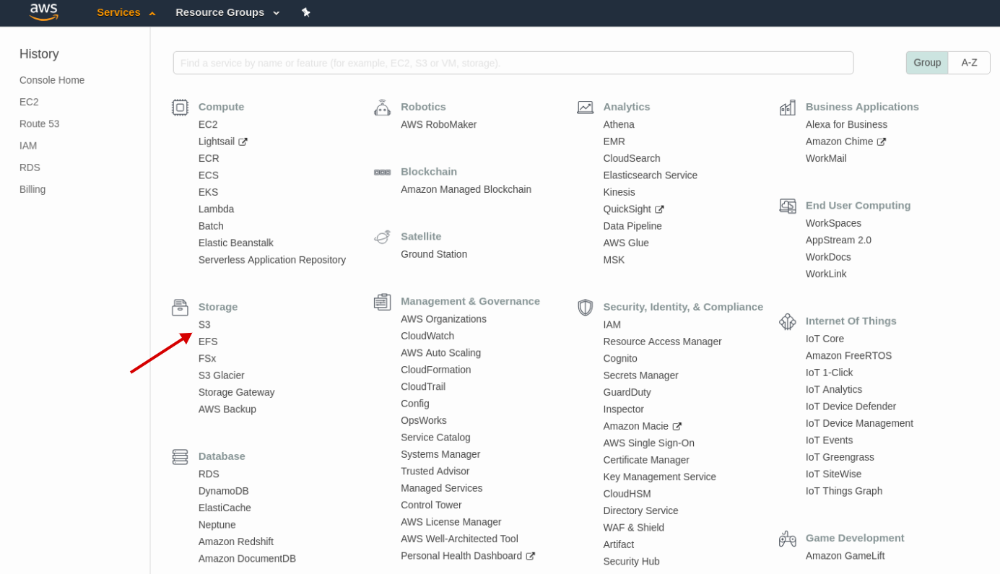
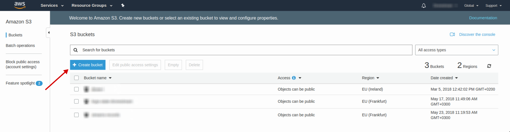
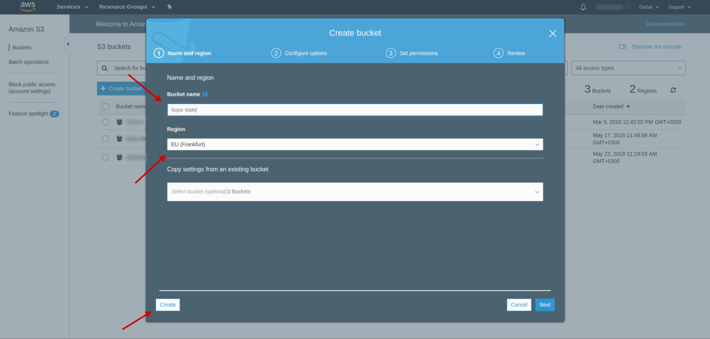
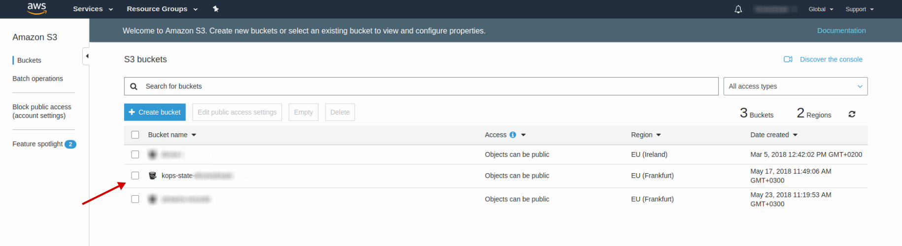

# S3 bucket

- Open [S3 AWS Console](https://s3.console.aws.amazon.com/s3/home?region=eu-central-1)

  

- Press `Create bucket` button

  

- Enter bucket name `kops-state-<project_name_or_whatever_unique>` (e.g. `kops-state-r4nd0m`)
- Create bucket

  

- Check created bucket

  

