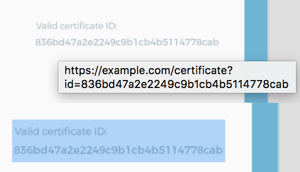

# Building .pdf with custom data from image (Python/Django)

## Requirements:
- font
- input [image](assets/building_pdf_from_image/input_image.jpg)
- custom data
- python environment with installed
```
Pillow==5.1.0
```

## Example
```python
from PIL import ImageFont, Image, ImageDraw
import os
import uuid


def generate_pdf_certificate():
    # Loading required assets (input image, font) and split font for a different font-sizes
    utils_folder = os.path.join(os.path.dirname(os.path.abspath(__file__)), "assets/")
    picture = os.path.join(os.path.join(utils_folder, "input_image.jpg"))
    font_montserrat_20 = ImageFont.truetype(os.path.join(utils_folder, "Montserrat-Regular.otf"), 20)
    font_montserrat_45 = ImageFont.truetype(os.path.join(utils_folder, "Montserrat-Regular.otf"), 45)
    font_montserrat_64 = ImageFont.truetype(os.path.join(utils_folder, "Montserrat-Regular.otf"), 64)

    # open input image and make in "drawable"
    picture = Image.open(picture)
    draw = ImageDraw.Draw(picture)

    # insert text data, first and last name, customize text size, color, position on the image
    full_name = "{} {}".format("John", "Smith")
    full_name_length_in_pixels = draw.textsize(full_name, font=font_montserrat_64)
    full_name_center_width = full_name_length_in_pixels[0] / 2
    full_name_color = "#4a4a4a"
    full_name_position = (898.5 - full_name_center_width, 463)
    draw.text(full_name_position, full_name, fill=full_name_color, font=font_montserrat_64)

    # the same logic as with first/last name
    course_name = "Building pdf files"
    course_name_length_in_pixels = draw.textsize(course_name, font=font_montserrat_45)
    course_name_center_width = course_name_length_in_pixels[0] / 2
    course_name_color = "#696969"
    course_name_position = (900 - course_name_center_width, 661.5)
    draw.text(course_name_position, course_name, fill=course_name_color, font=font_montserrat_45)

    # the same logic as with first/last name
    certificate_id = uuid.uuid4().hex
    certificate_id_color = "#b0c1c9"
    certificate_id_position = (1303, 1060)
    draw.text(certificate_id_position, certificate_id, fill=certificate_id_color, font=font_montserrat_20)

    # saving the final copy as .pdf file
    picture.save("output.pdf", format="PDF", save_all=True)


generate_pdf_certificate()
```
When you run this you will get an [output.pdf](assets/building_pdf_from_image/output.pdf).

If you want to make some text clickable to any URL, you need to:
- install next python packages
```
PyPDF2==1.26.0
reportlab==3.4.0
```
- add an import statements
```python
from PyPDF2.pdf import PdfFileWriter, PdfFileReader
from reportlab.pdfgen import canvas
from io import BytesIO
```
- save to the `BytesIO` final version of the `.pdf`
```python
certificate_io = BytesIO()
picture.save(certificate_io, format="PDF", save_all=True)
```
- declare `BytesIO`, `Canvas` object with width/height the same as `input_image.jpg`
```python
canvas_io = BytesIO()
c = canvas.Canvas(canvas_io, pagesize=(1800, 1271))
```
- mark rectangle zone, which you want to be clickable (starting from 0,0 bottom left)
```python
c.rect(1300, 175, 400, 80, stroke=0, fill=0)
```
- point zone to an URL
```python
c.linkURL("https://example.com/certificate?id={}".format(certificate_id), (1300, 175, 1700, 255), relative=1)
```
- save `Canvas` object
```python
 c.save()
```
- seek the `BytesIO` stream
```python
canvas_io.seek(0)
```
- merge two pdf pages into single one
```python
new_pdf = PdfFileReader(canvas_io)
existing_pdf = PdfFileReader(certificate_io)
output = PdfFileWriter()
page = existing_pdf.getPage(0)
page.mergePage(new_pdf.getPage(0))
output.addPage(page)
```
- forming an output `BytesIO` stream
```python
output_io = BytesIO()
output.write(output_io)
```
- saving final `BytesIO` stream to the `.pdf` file
```python
output_stream = open("output_url.pdf", "wb")
output.write(output_stream)
output_stream.close()
```

## Example with url
```python
from PIL import ImageFont, Image, ImageDraw
from PyPDF2.pdf import PdfFileWriter, PdfFileReader
from reportlab.pdfgen import canvas
from io import BytesIO
import os
import uuid


def generate_pdf_certificate():
    # Loading required assets (input image, font) and split font for a different font-sizes
    utils_folder = os.path.join(os.path.dirname(os.path.abspath(__file__)), "assets/")
    picture = os.path.join(os.path.join(utils_folder, "input_image.jpg"))
    font_montserrat_20 = ImageFont.truetype(os.path.join(utils_folder, "Montserrat-Regular.otf"), 20)
    font_montserrat_45 = ImageFont.truetype(os.path.join(utils_folder, "Montserrat-Regular.otf"), 45)
    font_montserrat_64 = ImageFont.truetype(os.path.join(utils_folder, "Montserrat-Regular.otf"), 64)

    # open input image and make in "drawable"
    picture = Image.open(picture)
    draw = ImageDraw.Draw(picture)

    # insert text data, first and last name, customize text size, color, position on the image
    full_name = "{} {}".format("John", "Smith")
    full_name_length_in_pixels = draw.textsize(full_name, font=font_montserrat_64)
    full_name_center_width = full_name_length_in_pixels[0] / 2
    full_name_color = "#4a4a4a"
    full_name_position = (898.5 - full_name_center_width, 463)
    draw.text(full_name_position, full_name, fill=full_name_color, font=font_montserrat_64)

    # the same logic as with first/last name
    course_name = "Building pdf files"
    course_name_length_in_pixels = draw.textsize(course_name, font=font_montserrat_45)
    course_name_center_width = course_name_length_in_pixels[0] / 2
    course_name_color = "#696969"
    course_name_position = (900 - course_name_center_width, 661.5)
    draw.text(course_name_position, course_name, fill=course_name_color, font=font_montserrat_45)

    # the same logic as with first/last name
    certificate_id = uuid.uuid4().hex
    certificate_id_color = "#b0c1c9"
    certificate_id_position = (1303, 1060)
    draw.text(certificate_id_position, certificate_id, fill=certificate_id_color, font=font_montserrat_20)

    # save to the `BytesIO` final version of the `.pdf`
    certificate_io = BytesIO()
    picture.save(certificate_io, format="PDF", save_all=True)

    # declare `BytesIO`, `Canvas` object with width/height the same as `input_image.jpg`
    canvas_io = BytesIO()
    c = canvas.Canvas(canvas_io, pagesize=(1800, 1271))

    # mark rectangle zone, which you want to be clickable (starting from 0,0 bottom left)
    c.rect(1300, 175, 400, 80, stroke=0, fill=0)

    # point zone to an URL
    c.linkURL("https://example.com/certificate?id={}".format(certificate_id), (1300, 175, 1700, 255), relative=1)

    # save `Canvas` object
    c.save()

    # seek the `BytesIO` stream
    canvas_io.seek(0)

    # merge two pdf pages into single one
    new_pdf = PdfFileReader(canvas_io)
    existing_pdf = PdfFileReader(certificate_io)
    output = PdfFileWriter()
    page = existing_pdf.getPage(0)
    page.mergePage(new_pdf.getPage(0))
    output.addPage(page)

    # forming an output `BytesIO` stream
    output_io = BytesIO()
    output.write(output_io)

    # saving final `BytesIO` stream to the `.pdf` file
    output_stream = open("output_url.pdf", "wb")
    output.write(output_stream)
    output_stream.close()


generate_pdf_certificate()
```

And you will get [output_url.pdf](assets/building_pdf_from_image/output_url.pdf).
<p align="center">
  
</p>

## Saving to Django model(also S3 support)
- add new import statement
```
from django.core.files.uploadedfile import InMemoryUploadedFile
```
- don't save as file
```
output_stream = open("output_url.pdf", "wb")
output.write(output_stream)
output_stream.close()
```
- instead use builtin `InMemoryUploadedFile` to save the `output_io` stream
```
thumb_file = InMemoryUploadedFile(output_io, None, 'foo.pdf', 'application/pdf', output_io.tell(), None)
```
- add function return statement
```
return thumb_file
```
- call function on Model field and save
```
Model.field = generate_pdf_certificate()
Model.save()
```
