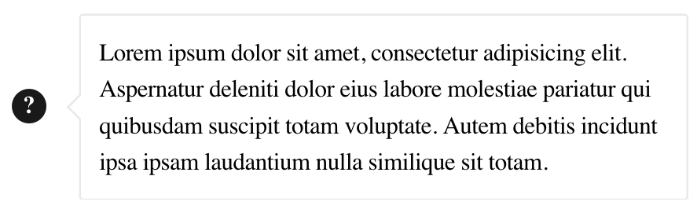
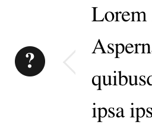
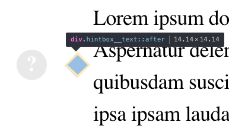
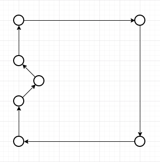

# Custom hintbox

## Demo


## HTML code
```html
<div class="hintbox">
    <div class="hintbox__icon">?</div>
    <div class="hintbox__text">Lorem ipsum dolor sit amet, consectetur adipisicing elit. Aspernatur deleniti dolor eius labore molestiae pariatur qui quibusdam suscipit totam voluptate. Autem debitis incidunt ipsa ipsam laudantium nulla similique sit totam.</div>
</div>
```

## SASS code
```sass
.hintbox
  display: flex
  position: relative
  justify-content: space-between
  margin-left: 18px
  font-size: 14px
  font-weight: 500

  &__text
    display: none
    position: absolute
    top: 50%
    min-width: 180px
    max-width: 300px
    margin-left: 33px
    padding: 10px
    transform: translateY(-50%)
    font-size: 12px
    letter-spacing: -.2px
    line-height: 18px
    z-index: 4

    &::before,
    &::after
      position: absolute
      border: 1px solid #ececec
      content: ''

    &::before
      top: 0
      left: 0
      width: 100%
      height: 100%
      border-radius: 2px
      background-color: #fff
      z-index: -1
      clip-path: polygon(0 0, 100% 0, 100% 100%, 0 100%, 0 calc(50% + 5px), 5px 50%, 0 calc(50% - 5px))

    &::after
      top: calc(50% - 5px)
      left: -4px
      width: 10px
      height: 10px
      transform: rotate(45deg)
      border-top-color: transparent
      border-right-color: transparent
      background-color: #fff

  &__icon
    width: 17px
    height: 17px
    border-radius: 50%
    background-color: #ececec
    color: #fff
    font-size: 12px
    font-weight: bold
    line-height: 17px
    text-align: center
    cursor: pointer

    &:hover
      background-color: #1a1a1a

  &:hover
    .hintbox__text
      display: inline-block
```

## Clip-path explanation

### Left corner
Hintbox corner is just square with transparent border top and right rotated by 45 degrees.



### Hintbox
The internal hintbox build with clip-path, using 7 dots, start at 0,0 at the left top corner.

