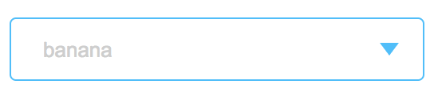
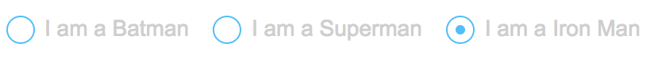
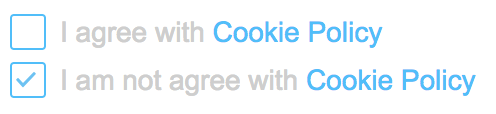
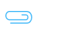

# Custom UI elements coding
In this examples we will use sass, feel free to transform it to any of pure css or css preprocessors
[Examples](./ui_elements)

## Custom select
If you want change styles of select but dont whant to user any library for it
```sass
.c-select
  padding: 0
  margin: 0
  border: 1px solid deepskyblue
  position: relative
  overflow: hidden
  background: #ffffff
  background-size: 25%
  cursor: pointer
  text-align: center
  display: block
  width: 100%
  max-width: 260px
  height: 40px
  line-height: 40px
  border-radius: 4px
  outline: 0
  font-size: 13px
  &:after
    content: ''
    position: absolute
    top: 50%
    transform: translateY(-50%)
    right: 15px
    width: 0
    height: 0
    border-style: solid
    border-width: 8px 6px 0 6px
    border-color: deepskyblue transparent transparent transparent
  select
    padding-left: 20px
    cursor: pointer
    width: 130%
    font-size: 13px
    color: #cecece
    border: none
    box-shadow: none
    background-color: transparent
    background-image: none
    -webkit-appearance: none
    -moz-appearance: none
    appearance: none
    &:focus
      outline: none
```

```html
<div class="c-select">
    <select>
        <option>banana</option>
        <option>orange</option>
        <option>apple</option>
        <option>watermelon</option>
    </select>
</div>
```
<p align="center">
  
</p>

## Custom input type radio

```sass
.c-radio
  display: inline-block
  text-align: left
  cursor: pointer
  font-weight: 500
  padding: 12px 10px 0 0
  input
    visibility: hidden
    opacity: 0
    position: absolute
  input:checked + span
    &:after
      content: ''
      position: absolute
      top: 6px
      left: -18px
      height: 6px
      width: 6px
      border-radius: 50%
      background-color: deepskyblue
  span
    position: relative
    color: #cecece
    font-size: 14px
    margin-left: 25px
    display: inline-block
    &:before
      content: ''
      position: absolute
      top: 0
      left: -24px
      height: 16px
      width: 16px
      border: 1px solid deepskyblue
      border-radius: 50%
```

```html
<label class="c-radio">
    <input value="1" name="radio" type="radio" checked>
    <span> I am a Batman </span>
</label>
```
<p align="center">
  
</p>

## Custom input type checkbox
```sass
.c-checkbox
  padding-left: 25px
  cursor: pointer
  display: inline-block
  height: 24px
  input:checked + span:after
    opacity: 1
  input
    position: absolute
    z-index: -1
    opacity: 0
  span
    position: relative
    font-size: 14px
    color: #cecece
    a
      text-decoration: none
      color: deepskyblue
    &:before
      position: absolute
      content: ''
      display: block
      left: -25px
      top: 50%
      transform: translateY(-50%)
      width: 16px
      height: 16px
      background-color: transparent
      border: 1px solid deepskyblue
      border-radius: 2px
      z-index: 2
    &:after
      position: absolute
      content: ''
      display: block
      left: -25px
      top: 50%
      transform: translateY(-50%)
      width: 16px
      height: 16px
      z-index: 3
      // link to your svg with arrow
      background: url(../assets/down-arrow.svg) no-repeat center center
      background-size: 65%
      opacity: 0
```

```html
<div>
    <label class="c-checkbox">
        <input type="checkbox" name="terms" checked>
        <span>I agree with <a href="#" target="_blank">Cookie Policy</a></span>
    </label>
</div>
```
<p align="center">
  
</p>

## Custom input type file
```sass
.c-input-file //should be label with input inside
  input
    opacity: 0
    position: absolute
    height: 0
```

```html
<label class="c-input-file">
    <!--here any content that should be displayed in our case svg -->
    
    <input type="file" name="file">
</label>
```
<p align="center">
  
</p>
