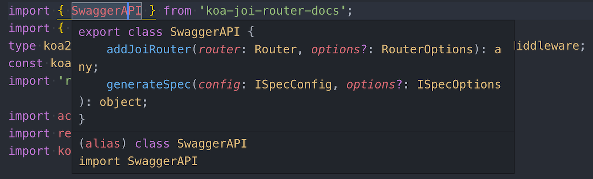
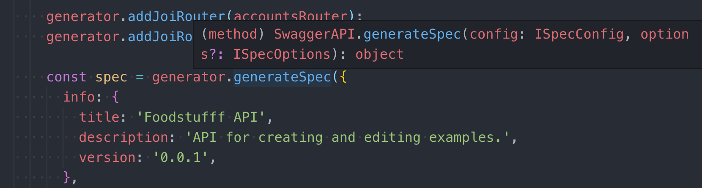

# Writing custom Typescript type definitions

Sometime when you are writing Typescript code (no matter on backend or frontend) you may use JavaScript libraries which are not written in Typescript. That's why a lot of libraries have their typings defined separately in [DefinitelyTyped](https://github.com/DefinitelyTyped/DefinitelyTyped) repository.

Let's have an example what you can do If you using JS library without type definitions. For an example we will use [koa-joi-router-docs](https://github.com/chuyik/koa-joi-router-docs/).

## Try to install type definitions from DefinitelyTyped
```bash
# npm i @types/<package_name>
npm i @types/koa-joi-router-docs
```
If it's a popular library then you are likely to be able to get types for it, but what if there are no types?

## Writing types locally in your project
```bash
# create "@types" folder in your "src"
cd src
mkdir types
# create "<package_name>" folder in "@types"
mkdir koa-joi-router-docs
# create "index.d.ts" file which will contain all typings
cd koa-joi-router-docs
touch index.d.ts
```

At this point you need to go through the source code of JS library and try to understand what does it export and what kind of parameters accepts.

In my case this is `SwaggerAPI` class with `addJoiRouter` and `generateSpec` methods.
So we define module with `SwaggerAPI` class and interfaces which are used to validate parameters of `addJoiRouter` and `generateSpec` methods.

```typescript
declare module 'koa-joi-router-docs' {
    import { Router } from 'koa-joi-router';

    interface ISpecConfig {
        info: {
            title: string;
            version: string;
            description: string;
        },
        basePath: string;
        tags: {
            name: string;
            description: string;
        }[];
    }
    
    interface ISpecOptions {
        warnFunc?: Function;
        defaultResponses?: object;
    }
    
    type RouterOptions = object | string;
    
    
    export class SwaggerAPI {
        addJoiRouter(router: Router, options?: RouterOptions): any;
        generateSpec(config: ISpecConfig, options?: ISpecOptions): object;
    }
}
```
After that we will have our suggestions in our project:

<p align="center">
  
</p>

<p align="center">
  
</p>

## Adding our types to DefinitelyTyped
```bash
# Clone repository to your local machine
npm i
# Generate a new types from template
# npx dts-gen --dt --name <package_name> --template module
npx dts-gen --dt --name koa-joi-router-docs --template module
```
This will generate for you folder in `@types/koa-joi-router-docs` with the next files:
- `index.d.ts` - file where we should put our definitions
- `koa-joi-router-docs-tests.ts` - file where we should write some tests to test our definitions
- `tslint.json` - tslinf configuration
- `tsconfig.json` - typescript configuration

After that we can just copy-paste our local typings inside the `index.d.ts` at DefinitelyTyped and run linter.

```bash
npm run lint koa-joi-router-docs
```

Probably you will have some issues, because DefinitelyTyped used a lot of custom rules which makes code style of all this types similar and scalable.

When you will fix all issues, you will get something that looks like this:
```typescript
// Type definitions for koa-joi-router-docs 1.0
// Project: https://github.com/o2team/koa-joi-router-docs#readme
// Definitions by: 4doge <https://github.com/4doge>
// Definitions: https://github.com/DefinitelyTyped/DefinitelyTyped
// TypeScript Version: 2.4

import { Router } from 'koa-joi-router';

export {};

declare namespace koaJoiRouterDocs {
    interface SpecConfig {
        info: {
            title: string;
            version: string;
            description: string;
        };
        basePath: string;
        tags: Array<{
            name: string;
            description: string;
        }>;
    }

    interface SpecOptions {
        warnFunc?: () => void;
        defaultResponses?: object;
    }

    type RouterOptions = object | string;
}

export class SwaggerAPI {
    addJoiRouter(router: Router, options?: koaJoiRouterDocs.RouterOptions): any;
    generateSpec(config: koaJoiRouterDocs.SpecConfig, options?: koaJoiRouterDocs.SpecOptions): object;
}
```

Pretty simple and simple, since we already write that typings in our local project.
Don't forget to write tests **(!)**.

```typescript
import * as Router from 'koa-joi-router';
import * as Koa from 'koa';
import { SwaggerAPI } from 'koa-joi-router-docs';

const Joi = Router.Joi;
const app = new Koa();
const router = Router();
const generator = new SwaggerAPI();

router.route({
  method: 'get',
  path: '/say-hello/:name',
  validate: {
    params: {
      name: Joi.string().required(),
    },
    output: {
      200: {
        body: Joi.object({
          greetings: Joi.string(),
        })
      }
    },
  },
  handler: async (ctx) => {
    ctx.body = {
      greetings: `Hello, ${ctx.request.params.name}!`,
    };
  }
});

generator.addJoiRouter(router);
const spec = generator.generateSpec({
  info: {
    title: 'Awesome API',
    description: 'API for creating and editing examples.',
    version: '0.0.1',
  },
  basePath: '/',
  tags: [
    {
      name: 'greetings',
      description: 'Group of API methods ',
    },
  ],
}, {
  defaultResponses: {},
  warnFunc: () => {
    console.log('Something happen...');
  }
});

router.get('/api.json', async (ctx) => {
  ctx.body = JSON.stringify(spec, null, '  ');
});

app.use(router.middleware());

app.listen(3000, () => {
  console.log('Server running on port 3000');
});
```

Basically it's just simple Koa-based server, which setup one route and generate docs.
Run the tests.
```bash
npm run tests
```

If everyting works fine, you are ready to open PR at DefinitelyTyped 😎

## References
- [DefinitelyTyped](https://github.com/DefinitelyTyped/DefinitelyTyped)
- [koa-joi-router-docs](https://github.com/chuyik/koa-joi-router-docs/)