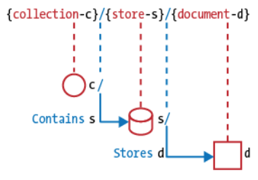

# REST API URL Patterns

## Resource model
<p align="center">
  
</p>
**Document** - resource, object or instance, database record.
```
http://api.soccer.restapi.org/leagues/seattle
http://api.soccer.restapi.org/leagues/seattle/teams/trebuchet
http://api.soccer.restapi.org/leagues/seattle/teams/trebuchet/players/mike
```
**Collection** - server-managed directory of resources.
```
http://api.soccer.restapi.org/leagues
http://api.soccer.restapi.org/leagues/seattle/teams
http://api.soccer.restapi.org/leagues/seattle/teams/trebuchet/players
```
**Store** - client-managed resource repository. A store resource lets an API client put
resources in, get them back out, and decide when to delete them. On their own, stores
do not create new resources; therefore a store never generates new URIs. Instead, each
stored resource has a URI that was chosen by a client when it was initially put into the
store.
```
PUT /users/1234/favorites/alonso
```
**Controller** - procedural concept, executable functions, with parameters and return values; inputs and outputs.
```
POST /alerts/245743/resend
```

#### Rules relating to the design of meaningful URI paths
1. A singular noun should be used for document names
```
http://api.soccer.restapi.org/leagues/seattle/teams/trebuchet/players/claudio
```

2. A plural noun should be used for collection names
```
http://api.soccer.restapi.org/leagues/seattle/teams/trebuchet/players
```

3. A plural noun should be used for store names
```
http://api.music.restapi.org/artists/mikemassedotcom/playlists
```

4. A verb or verb phrase should be used for controller names
```
http://api.college.restapi.org/students/morgan/register
http://api.example.restapi.org/lists/4324/dedupe
http://api.ognom.restapi.org/dbs/reindex
http://api.build.restapi.org/qa/nightly/runTestSuite
```

5. Variable path segments may be substituted with identity-based
values
```
http://api.soccer.restapi.org/leagues/{leagueId}/teams/{teamId}/players/{playerId}
http://api.soccer.restapi.org/leagues/seattle/teams/trebuchet/players/21
```

6. CRUD function names should not be used in URIs
```
DELETE /users/1234
```
instead of:
```
GET /deleteUser?id=1234
GET /deleteUser/1234
DELETE /deleteUser/1234
POST /users/1234/delete
```

## URI structure
RFC 3986 defines the generic URI syntax as shown below:
```
URI = scheme "://" authority "/" path [ "?" query ] [ "#" fragment ]
```

#### Rules to URI Query Design
1. The query component of a URI may be used to filter collections or stores
```
GET /users
GET /users?role=admin
```

2. The query component of a URI should be used to paginate collection
or store results  
A REST API client should use the query component to paginate collection and store
results with the **pageSize** and **pageStartIndex** parameters. The **pageSize** parameter
specifies the maximum number of contained elements to return in the response. The
**pageStartIndex** parameter specifies the zero-based index of the first element to return
in the response
```
GET /users?pageSize=25&pageStartIndex=50
```

## Identifier Design with URIs

#### Rules to URI format
1. Forward slash separator `/` must be used to indicate a hierarchical
relationship
`http://api.canvas.restapi.org/shapes/polygons/quadrilaterals/squares`

2. A trailing forward slash `/` should not be included in URIs
`http://api.canvas.restapi.org/shapes/polygons/quadrilaterals/squares` instead of:
`http://api.canvas.restapi.org/shapes/polygons/quadrilaterals/squares/`

3. Hyphens (-) should be used to improve the readability of URIs
`http://api.example.restapi.org/blogs/mark-masse/entries/this-is-my-first-post`

4. Underscores `_` should not be used in URIs

5. Uppercase letters should not be used in URIs
`http://api.example.restapi.org/my-folder/my-doc`

6. File extensions should not be included in URIs
`http://api.college.restapi.org/students/3248234/transcripts/2005/fall`
instead of
`http://api.college.restapi.org/students/3248234/transcripts/2005/fall.json`

## Interaction Design with HTTP

#### Rules about using HTTP methods
1. GET and POST must not be used to tunnel other request methods
2. GET must be used to retrieve a representation of a resource
3. HEAD should be used to retrieve response headers
4. PUT must be used to both insert and update a stored resource
5. PUT must be used to update mutable resources
6. POST must be used to create a new resource in a collection
7. POST must be used to execute controllers
8. DELETE must be used to remove a resource from its parent
9. OPTIONS should be used to retrieve metadata that describes a
resource’s available interactions


#### Status codes categories
|Category|Description|
|--------|-----------|
|1xx: Informational | Communicates transfer protocol-level information |
|2xx: Success | Indicates that the client request was accepted successfully |
|3xx: Redirection | Indicates that the client must take some additional action in order to complete their request |
|4xx: Client Error | This category of error status codes points the finger at clients |
|5xx: Server Error | The server takes responsibility for these error status codes |


#### Rules about using status codes
1. 200 (“OK”) should be used to indicate nonspecific success
2. 200 (“OK”) must not be used to communicate errors in the response
body
3. 201 (“Created”) must be used to indicate successful resource creation
4. 202 (“Accepted”) must be used to indicate successful start of an
asynchronous action
5. 204 (“No Content”) should be used when the response body is
intentionally empty
6. 301 (“Moved Permanently”) should be used to relocate resources
7. 302 (“Found”) should not be used
8. 303 (“See Other”) should be used to refer the client to a different URI
9. 304 (“Not Modified”) should be used to preserve bandwidth
10. 307 (“Temporary Redirect”) should be used to tell clients to resubmit
the request to another URI
11. 400 (“Bad Request”) may be used to indicate nonspecific failure
12. 401 (“Unauthorized”) must be used when there is a problem with the
client’s credentials
13. 403 (“Forbidden”) should be used to forbid access regardless of
authorization state
14. 404 (“Not Found”) must be used when a client’s URI cannot be mapped
to a resource
15. 405 (“Method Not Allowed”) must be used when the HTTP method is
not supported
16. 406 (“Not Acceptable”) must be used when the requested media type
cannot be served
17. 409 (“Conflict”) should be used to indicate a violation of resource state
18. 412 (“Precondition Failed”) should be used to support conditional
operations
19. 415 (“Unsupported Media Type”) must be used when the media type
of a request’s payload cannot be processed
20. 500 (“Internal Server Error”) should be used to indicate API
malfunction
