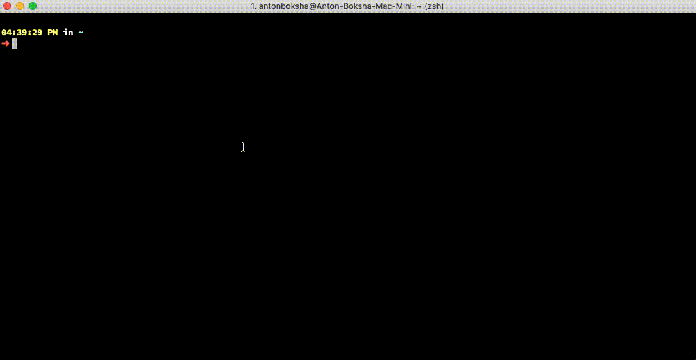

# Configuration better Unix shell


## Requirements
- MacOS
- [iTerm2](https://www.iterm2.com/)
- [Brew](https://brew.sh/)


## Zsh installation
To install `zsh` and `zsh-copletions` run next command:
```bash
brew install zsh zsh-completions
```
- To use `zsh` which is installed by brew run:
```bash
sudo dscl . -create /Users/$USER UserShell /usr/local/bin/zsh
```

- Change your default shell to `zsh`
```bash
chsh -s $(which zsh)
```

- In iTerm2 select `zsh` as default shell. Go to `Preferences` > `Profiles` > `General` > `Command` and paste this value here:
```bash
/usr/local/bin/zsh
```
After that restart iTerm2, you should see `zsh` configuration prompt for new users.

- Check if everything is correct
```bash
echo $SHELL
```
expected result is `/usr/local/bin/zsh`

- Intall Oh My Zsh
```bash
sh -c "$(curl -fsSL https://raw.githubusercontent.com/robbyrussell/oh-my-zsh/master/tools/install.sh)"
```

- Install `zsh-syntax-highlighting`
```bash
brew install zsh-syntax-highlighting
```
Add next line to the end of `.zshrc`
```bash
source /usr/local/share/zsh-syntax-highlighting/zsh-syntax-highlighting.zsh
```
Restart iTerm2


- Install Spaceship command prompt
```bash
git clone https://github.com/denysdovhan/spaceship-prompt.git "$ZSH_CUSTOM/themes/spaceship-prompt"
ln -s "$ZSH_CUSTOM/themes/spaceship-prompt/spaceship.zsh-theme" "$ZSH_CUSTOM/themes/spaceship.zsh-theme"
```

- set in `.zshrc`
```bash
ZSH_THEME="spaceship"
```

## Final result
<p align="center">
  
</p>

## References
- [Oh My Zsh](https://ohmyz.sh/)
- [zsh completions](https://github.com/zsh-users/zsh-completions)
- [Change Mac OS default zsh to brew installed](https://rick.cogley.info/post/use-homebrew-zsh-instead-of-the-osx-default)
- [zsh syntax highlighting](https://github.com/zsh-users/zsh-syntax-highlighting)
- [spaceship prompt](https://github.com/denysdovhan/spaceship-prompt)

